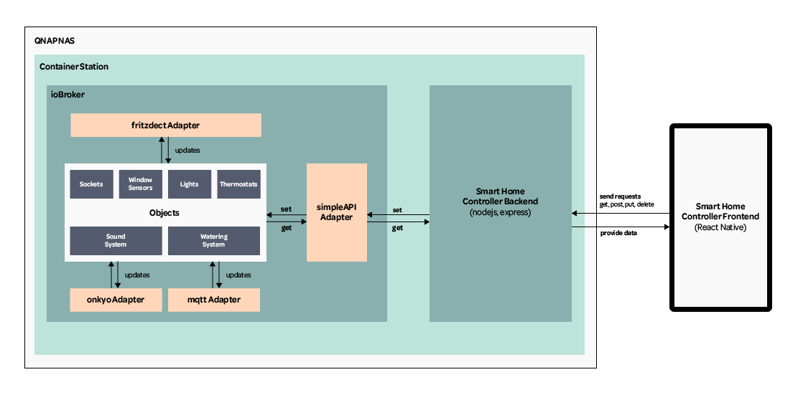

# SmartHomeAPI

## About

## Setup

1. Create project folder
2. Inside folder run 'npm init -y'
3. Run 'npm install express --save' and 'npm i @types/express --save'
4. Run 'npm i -D nodemon' (nodemon is a tool that helps develop Node.js based applications by automatically restarting the node application when file changes in the directory are detected. - https://www.npmjs.com/package/nodemon)
4. Inside package.json add '"start": "node index.js",' to "srcipts"

### Setup TypeScript

1. Run 'npm i -D typescript ts-node' (-D flag short for --save-dev)
2. Inside package.json add '"tsc": "tsc"' to "scripts"
3. Run 'npm run tsc -- --init'

### Helpful Resources
* https://dev.to/sulistef/how-to-set-up-routing-in-an-expressjs-project-using-typescript-51ib
* https://dev.to/sulistef/how-to-set-up-a-nodejs-backend-using-expressjs-and-typescript-1655
* https://www.youtube.com/watch?v=aUMGAFE5pPM